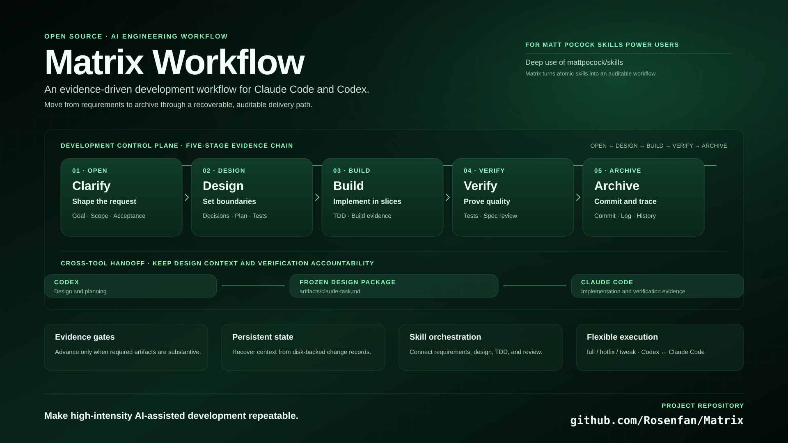

# Matrix Workflow

A structured workflow orchestrator for [Matt Pocock's Claude Code skills](https://github.com/mattpocock/skills), inspired by [Comet](https://github.com/rpamis/comet). It enforces evidence-based phase transitions to standardize your development process when using these skills.

English | **[中文](./README.zh-CN.md)**

<p align="center">
  
</p>

---

## Table of Contents

- [Why Matrix?](#why-matrix)
- [What It Does](#what-it-does)
- [Prerequisites](#prerequisites)
- [Installation](#installation)
- [Quick Start](#quick-start)
- [Workflow Phases](#workflow-phases)
- [How It Works](#how-it-works)
- [Workflow Types](#workflow-types)
- [Integration with Matt Pocock's Skills](#integration-with-matt-pococks-skills)
- [License](#license)

---

## Why Matrix

[Matt Pocock's skills](https://github.com/mattpocock/skills) are excellent individual tools — `/grill-with-docs` for requirements, `/tdd` for test-driven development, `/implement` for execution. But using them in isolation leads to common problems:

- **No process memory**: You grill, then implement, but there's no record of what was decided
- **Phase confusion**: Did we finish design? Are we in build? Hard to tell after context loss
- **Silent scope creep**: Requirements change mid-build without returning to design
- **Missing evidence**: "Looks done" without verification proof

Matrix solves this by wrapping these skills into a deterministic state machine with explicit phases, guard conditions, and artifact tracking — inspired by [Comet](https://github.com/rpamis/comet)'s phase-based approach.

---

## What It Does

Matrix orchestrates Matt Pocock's skills into a structured workflow:

```
open → design → build → verify → archive
  ↓       ↓        ↓        ↓        ↓
grill   plan    implement  tdd    commit
        design            review
```

Each phase:
- Has specific deliverables (artifacts)
- Has guard conditions that must pass
- Logs all transitions
- Survives context loss (state on disk)

---

## Prerequisites

- [Claude Code](https://docs.anthropic.com/claude-code) installed
- [Matt Pocock's skills](https://github.com/mattpocock/skills) installed in your project
- Python 3.8+ in PATH

---

## Installation

### 1. Install Matt Pocock's Skills First

```bash
npx skills@latest add mattpocock/skills
```

### 2. Install Matrix Workflow

Copy the matrix skills into your project's `.claude/skills/` directory:

```bash
# Clone this repo
git clone https://github.com/yourusername/matrix-workflow.git /tmp/matrix-workflow

# Copy matrix skills to your project
cp -r /tmp/matrix-workflow/.claude/skills/matrix* /path/to/your/project/.claude/skills/
```

This installs:
- `matrix/` — Entry point and state management
- `matrix-open/` — Open phase (uses `/grill-with-docs`)
- `matrix-design/` — Design phase (uses `/prototype`, `/research`)
- `matrix-build/` — Build phase (uses `/implement`, `/tdd`)
- `matrix-verify/` — Verify phase (uses `/code-review`)
- `matrix-archive/` — Archive phase
- `matrix-hotfix/` — Shortcut for small bugs
- `matrix-tweak/` — Shortcut for bounded changes
- `matrix-status/` — Check current state
- `matrix-claude/` — Optional: export for Claude Code

---

## Quick Start

In Claude Code:

```
$matrix I want to add user authentication
```

Matrix will:
1. Initialize a change with workflow type `full`
2. Enter `open` phase → invokes `/grill-with-docs` to clarify requirements
3. Create `proposal.md` with Goal, Scope, Acceptance, Risks
4. Guard check: are all sections substantive?
5. If pass → transition to `design`

---

## Workflow Phases

| Phase | Matt Pocock Skills Used | Deliverables | Guard Condition |
|-------|-------------------------|--------------|-----------------|
| **open** | `/grill-with-docs` (auto-invokes `/grilling` + `/domain-modeling`) | `proposal.md`, `CONTEXT.md`, ADRs | Goal, Scope, Acceptance, Risks present |
| **design** | `/domain-modeling` → `/research` → `/wayfinder` → `/prototype` → `/codebase-design` | `design.md`, `plan.md` | Decisions, Test seams, Steps documented |
| **build** | `/implement` (auto-invokes `/tdd` + `/code-review`), `/diagnosing-bugs`, `/resolving-merge-conflicts` | Code, `verification.md` | Plan exists, build evidence recorded |
| **verify** | `/code-review` (two-axis: Standards + Spec), `/improve-codebase-architecture` | Test & review evidence | Test and review evidence present |
| **archive** | — | Git commit | Verify guard passed |

---

## How It Works

State is stored in `.matrix/`:

```
.matrix/
├── active.json              # Current change ID
├── config.yaml
├── changes/
│   └── <change-id>/
│       ├── matrix.yaml      # Phase, workflow, timestamps
│       ├── run-state.json
│       ├── events.jsonl
│       └── artifacts/
│           ├── proposal.md
│           ├── design.md
│           ├── plan.md
│           └── verification.md
└── archive/
```

The state machine enforces transitions:

```bash
# Check guard
python .claude/skills/matrix/scripts/matrix_state.py guard open

# Advance (only if guard passes)
python .claude/skills/matrix/scripts/matrix_state.py transition design
```

---

## Workflow Types

| Type | When to Use | Phases |
|------|-------------|--------|
| **full** | New features, architecture changes | All 5 phases |
| **hotfix** | Reproducible small bugs | Simplified: open → build → verify → archive |
| **tweak** | Bounded changes, no API/schema impact | Simplified: open → build → verify → archive |

---

## Special Feature: matrix-claude

**Default usage**: Just use the main workflow (`$matrix`). Whether you're using Codex or Claude Code, the standard flow works for both:

```
$matrix → open → design → build → verify → archive
```

**When to use `$matrix-claude`**: Only when you want to **split the work across tools** — use Codex for design, then hand off to Claude Code for implementation.

| Scenario | What to Do |
|----------|------------|
| Use one tool for everything (default) | Just use `$matrix`, no extra steps |
| Codex designs + Codex implements | Standard flow: design → build → verify |
| Codex designs + Claude Code implements | design → `$matrix-claude` → Claude Code → verify |

### How matrix-claude Works

1. Design phase completes, guard passes
2. Run `$matrix-claude` → exports frozen design as `artifacts/claude-task.md`
3. Claude Code reads the task package and implements
4. Claude Code produces evidence in `artifacts/verification.md`
5. Return to Matrix: build guard → verify → archive

The sidecar does NOT change Matrix state. It's a pure export — like taking a snapshot of the design for another tool to consume.

---

## Integration with Matt Pocock's Skills

Matrix is designed to work **on top of** Matt Pocock's skills, not replace them. Here's how they map:

### open Phase

| Skill | How Matrix Uses It |
|-------|-------------------|
| `/grill-with-docs` | Main skill: runs `/grilling` + `/domain-modeling` to clarify requirements |
| `/grilling` | Stress-tests the plan through relentless Q&A |
| `/domain-modeling` | Establishes shared vocabulary, creates `CONTEXT.md` and ADRs |

### design Phase (Recommended Order)

| Order | Skill | How Matrix Uses It |
|-------|-------|-------------------|
| 1 | `/domain-modeling` | Establish or refine domain vocabulary from the proposal |
| 2 | `/research` | Investigate external APIs, docs, specs (runs in background) |
| 3 | `/wayfinder` | Explore complex codebase structure and dependencies |
| 4 | `/prototype` | Validate design questions with throwaway experiments |
| 5 | `/codebase-design` | Define module boundaries, interfaces, test seams |

### build Phase

| Skill | How Matrix Uses It |
|-------|-------------------|
| `/implement` | Main skill: executes plan with TDD, then runs code review, then commits |
| `/tdd` | Auto-invoked by `/implement`: red-green-refactor at pre-agreed seams |
| `/diagnosing-bugs` | On failure: builds tight feedback loop before fixing |
| `/resolving-merge-conflicts` | On merge conflicts: systematic resolution |

### verify Phase

| Skill | How Matrix Uses It |
|-------|-------------------|
| `/code-review` | Two-axis review: **Standards** (coding conventions) + **Spec** (requirements fidelity) |
| `/improve-codebase-architecture` | Optional: scan for shallow-module deepening opportunities |

---

**Key difference**: Matt Pocock's skills are individual tools. Matrix adds:
- **State persistence**: Survives context loss
- **Phase enforcement**: Can't skip design and jump to build
- **Evidence requirements**: Guards check for artifacts, not assertions
- **Transition logging**: Full audit trail of phase changes

---

## License

[MIT](./LICENSE)
