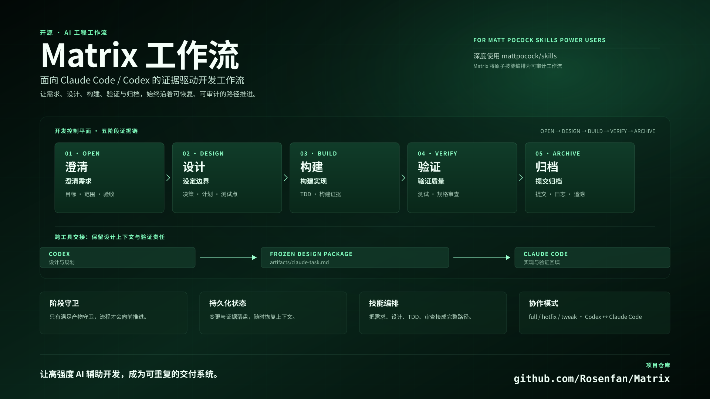

# Matrix Workflow

一个基于 [Matt Pocock 的 Claude Code skills](https://github.com/mattpocock/skills) 的结构化工作流编排器，灵感来自 [Comet](https://github.com/rpamis/comet)。它通过强制执行基于证据的阶段转换，规范使用这些 skills 时的开发流程。

**[English](./README.md)** | 中文

<p align="center">
  
</p>

---

## 目录

- [为什么需要 Matrix](#为什么需要-matrix)
- [它做了什么](#它做了什么)
- [前置条件](#前置条件)
- [安装](#安装)
- [快速开始](#快速开始)
- [工作流阶段](#工作流阶段)
- [工作原理](#工作原理)
- [工作流类型](#工作流类型)
- [与 Matt Pocock Skills 的集成](#与-matt-pocock-skills-的集成)
- [许可证](#许可证)

---

## 为什么需要 Matrix

[Matt Pocock 的 skills](https://github.com/mattpocock/skills) 是优秀的独立工具 —— `/grill-with-docs` 用于需求澄清，`/tdd` 用于测试驱动开发，`/implement` 用于执行实现。但单独使用它们会导致常见问题：

- **无流程记忆**：你进行了 grilling，然后实现，但没有记录决策过程
- **阶段混乱**：设计完成了吗？我们在构建阶段吗？上下文丢失后很难判断
- **静默范围蔓延**：需求在构建过程中变更，却没有返回设计阶段
- **缺少证据**："看起来完成了"却没有验证证明

Matrix 通过将这些 skills 封装到确定性状态机中来解决这些问题 —— 包含明确的阶段、守卫条件和产物追踪。灵感来自 [Comet](https://github.com/rpamis/comet) 的阶段式方法。

---

## 它做了什么

Matrix 将 Matt Pocock 的 skills 编排成结构化工作流：

```
open → design → build → verify → archive
(开放)  (设计)   (构建)   (验证)   (归档)
  ↓       ↓        ↓        ↓        ↓
grill   plan    implement  tdd    commit
        design            review
```

每个阶段：
- 有特定的交付物（产物）
- 有必须通过的守卫条件
- 记录所有转换
- 可承受上下文丢失（状态存储在磁盘上）

---

## 前置条件

- 已安装 [Claude Code](https://docs.anthropic.com/claude-code)
- 已在项目中安装 [Matt Pocock 的 skills](https://github.com/mattpocock/skills)
- Python 3.8+ 已添加到 PATH

---

## 安装

### 1. 先安装 Matt Pocock 的 Skills

```bash
npx skills@latest add mattpocock/skills
```

### 2. 安装 Matrix Workflow

将 matrix skills 复制到项目的 `.claude/skills/` 目录：

```bash
# 克隆本仓库
git clone https://github.com/yourusername/matrix-workflow.git /tmp/matrix-workflow

# 复制 matrix skills 到你的项目
cp -r /tmp/matrix-workflow/.claude/skills/matrix* /path/to/your/project/.claude/skills/
```

这将安装：
- `matrix/` — 入口点和状态管理
- `matrix-open/` — 开放阶段（使用 `/grill-with-docs`）
- `matrix-design/` — 设计阶段（使用 `/prototype`、`/research`）
- `matrix-build/` — 构建阶段（使用 `/implement`、`/tdd`）
- `matrix-verify/` — 验证阶段（使用 `/code-review`）
- `matrix-archive/` — 归档阶段
- `matrix-hotfix/` — 小型 Bug 快捷方式
- `matrix-tweak/` — 有界变更快捷方式
- `matrix-status/` — 检查当前状态
- `matrix-claude/` — 可选：导出供 Claude Code 使用

---

## 快速开始

在 Claude Code 中：

```
$matrix 我想给 API 添加用户认证
```

Matrix 将会：
1. 用工作流类型 `full` 初始化一个变更
2. 进入 `open` 阶段 → 调用 `/grill-with-docs` 澄清需求
3. 创建 `proposal.md`，包含目标、范围、验收标准、风险
4. 守卫检查：所有章节是否内容充实？
5. 如果通过 → 转换到 `design`

---

## 工作流阶段

| 阶段 | 使用的 Matt Pocock Skills | 交付物 | 守卫条件 |
|------|---------------------------|--------|----------|
| **open** | `/grill-with-docs`（自动调用 `/grilling` + `/domain-modeling`） | `proposal.md`、`CONTEXT.md`、ADRs | 目标、范围、验收标准、风险存在 |
| **design** | `/domain-modeling` → `/research` → `/wayfinder` → `/prototype` → `/codebase-design` | `design.md`、`plan.md` | 决策、测试点、步骤已记录 |
| **build** | `/implement`（自动调用 `/tdd` + `/code-review`）、`/diagnosing-bugs`、`/resolving-merge-conflicts` | 代码、`verification.md` | 计划存在，构建证据已记录 |
| **verify** | `/code-review`（双轴：Standards + Spec）、`/improve-codebase-architecture` | 测试和审查证据 | 测试和审查证据存在 |
| **archive** | — | Git commit | 验证守卫通过 |

---

## 工作原理

状态存储在 `.matrix/` 目录：

```
.matrix/
├── active.json              # 当前变更 ID
├── config.yaml
├── changes/
│   └── <change-id>/
│       ├── matrix.yaml      # 阶段、工作流、时间戳
│       ├── run-state.json
│       ├── events.jsonl
│       └── artifacts/
│           ├── proposal.md
│           ├── design.md
│           ├── plan.md
│           └── verification.md
└── archive/
```

状态机强制执行转换：

```bash
# 检查守卫
python .claude/skills/matrix/scripts/matrix_state.py guard open

# 推进（仅在守卫通过时）
python .claude/skills/matrix/scripts/matrix_state.py transition design
```

---

## 工作流类型

| 类型 | 使用场景 | 阶段 |
|------|----------|------|
| **full** | 新功能、架构变更 | 全部 5 个阶段 |
| **hotfix** | 可复现的小型 Bug | 简化：open → build → verify → archive |
| **tweak** | 有界变更，无 API/架构影响 | 简化：open → build → verify → archive |

---

## 特别功能：matrix-claude

**默认用法**：直接使用主流程即可。无论你用 Codex 还是 Claude Code，标准流程都适用：

```
$matrix → open → design → build → verify → archive
```

**何时使用 `$matrix-claude`**：仅当你想**跨工具拆分工作**时 —— 用 Codex 设计，然后交给 Claude Code 实现。

| 场景 | 操作 |
|------|------|
| 一个工具完成所有工作（默认） | 直接用 `$matrix`，无需额外步骤 |
| Codex 设计 + Codex 实现 | 标准流程：design → build → verify |
| Codex 设计 + Claude Code 实现 | design → `$matrix-claude` → Claude Code → verify |

### matrix-claude 工作原理

1. 设计阶段完成，守卫通过
2. 运行 `$matrix-claude` → 导出冻结的设计为 `artifacts/claude-task.md`
3. Claude Code 读取任务包并实现
4. Claude Code 在 `artifacts/verification.md` 中产生证据
5. 返回 Matrix：构建守卫 → 验证 → 归档

此 sidecar 不会改变 Matrix 状态。它只是纯粹的导出 —— 就像为另一个工具拍一张设计快照。

---

## 与 Matt Pocock Skills 的集成

Matrix 设计为**在 Matt Pocock 的 skills 之上工作**，而非替代它们。以下是各阶段的详细映射：

### open 阶段

| Skill | Matrix 如何使用 |
|-------|-----------------|
| `/grill-with-docs` | 主技能：运行 `/grilling` + `/domain-modeling` 澄清需求 |
| `/grilling` | 通过连续提问压力测试计划 |
| `/domain-modeling` | 建立共享词汇，创建 `CONTEXT.md` 和 ADRs |

### design 阶段（推荐顺序）

| 顺序 | Skill | Matrix 如何使用 |
|------|-------|-----------------|
| 1 | `/domain-modeling` | 从提案中建立或精炼领域词汇 |
| 2 | `/research` | 调查外部 API、文档、规范（后台运行） |
| 3 | `/wayfinder` | 探索复杂代码库结构和依赖 |
| 4 | `/prototype` | 用一次性实验验证设计问题 |
| 5 | `/codebase-design` | 定义模块边界、接口、测试点 |

### build 阶段

| Skill | Matrix 如何使用 |
|-------|-----------------|
| `/implement` | 主技能：执行计划，使用 TDD，运行代码审查，然后提交 |
| `/tdd` | 由 `/implement` 自动调用：在确认的接缝处进行红绿重构 |
| `/diagnosing-bugs` | 遇到失败时：先构建紧凑的反馈循环再修复 |
| `/resolving-merge-conflicts` | 遇到合并冲突时：系统性解决 |

### verify 阶段

| Skill | Matrix 如何使用 |
|-------|-----------------|
| `/code-review` | 双轴审查：**Standards**（编码规范）+ **Spec**（需求忠实度） |
| `/improve-codebase-architecture` | 可选：扫描浅模块深化机会 |

---

**关键区别**：Matt Pocock 的 skills 是独立工具。Matrix 增加了：
- **状态持久化**：可承受上下文丢失
- **阶段强制**：不能跳过设计直接进入构建
- **证据要求**：守卫检查产物，而非断言
- **转换日志**：完整的阶段变更审计记录

---

## 许可证

[MIT](./LICENSE)
